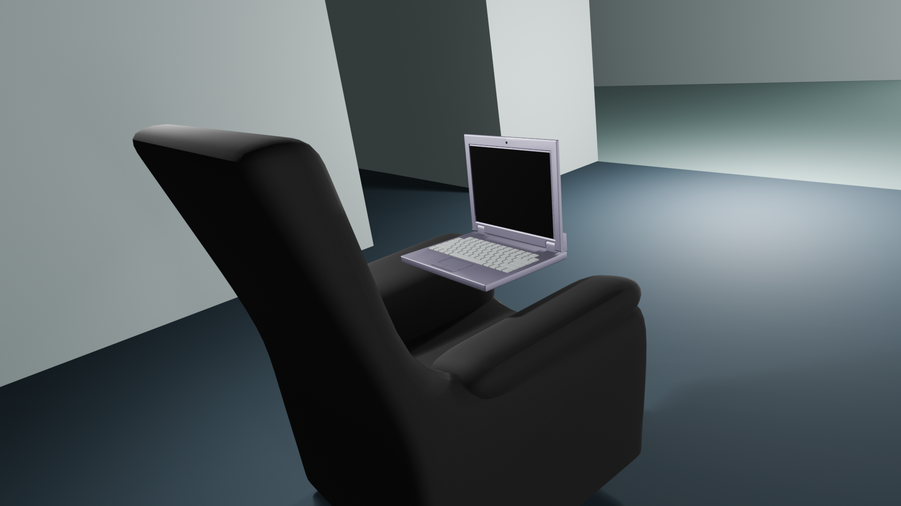

# Generic Laptop Model

The blend file in this repository resulted from importing a STL file and working it 
into Blender. Corners were bevelled and materials were added. Many triangles were converted 
to quads and some large flat areas were converted to polygons. This is essentially
a remix of a Barbie Laptop available on Thingiverse. Since this remix is not intended
to be printed I have posted it here rather than Thingiverse.

* [https://www.thingiverse.com/thing:3060905](https://www.thingiverse.com/thing:3060905) 

The following image is from the animation created in blender. The blend file in this 
repository contains only the remixed laptop.

An animation that makes use of this remixed generic laptop can be found on Youtube.

See [animation on Youtube](https://www.youtube.com/watch?v=BWWSsFbyqvk)
